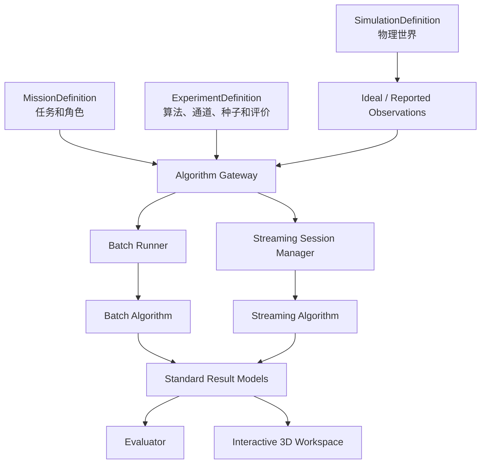
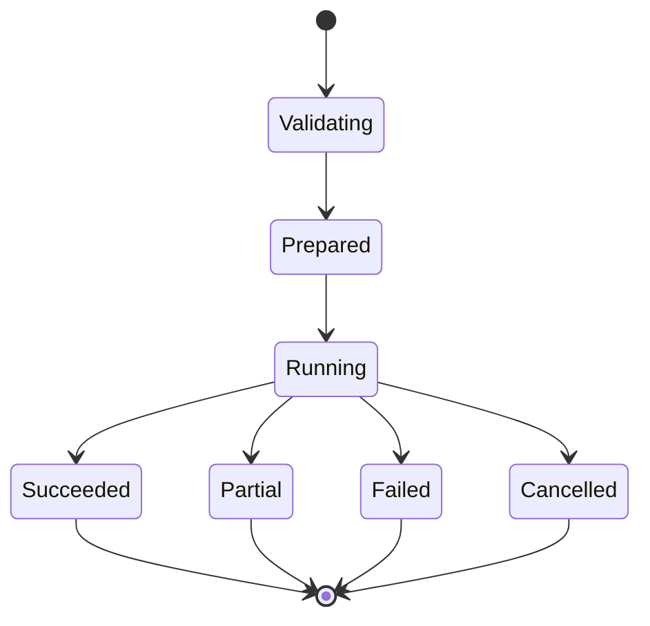
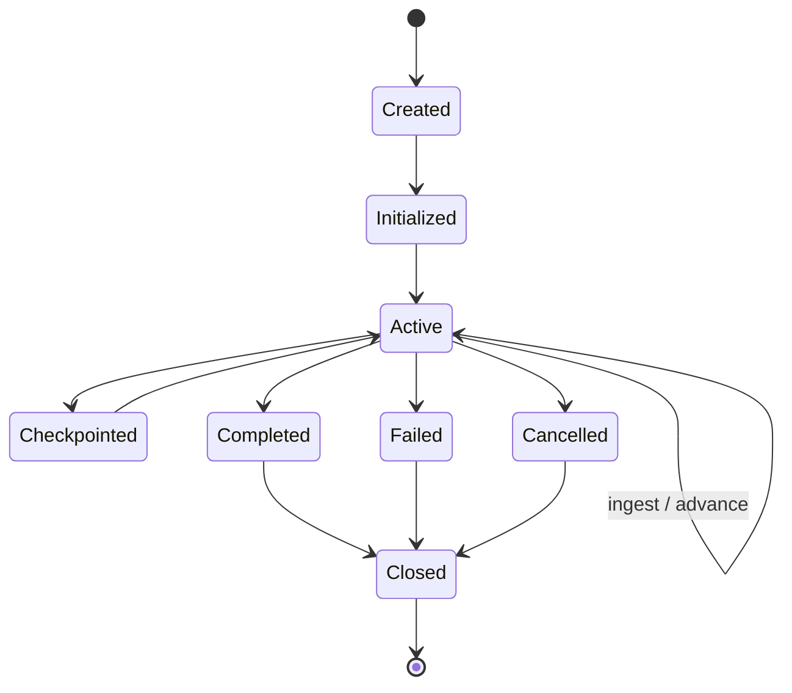

# SycaSphere 算法接入接口规范

**副标题：离线批处理、在线流式处理、算法注册与统一结果契约**

| 项目 | 内容 |
| --- | --- |
| 项目名称 | SycaSphere |
| 文档版本 | v0.2 |
| 状态 | 开发基线 |
| 日期 | 2026-07-17 |
| 作者 | Sycamore |
| 适用范围 | SycaSphere 首个可开发版本 |

## 文档约定

- **必须**：当前接口契约不可省略。
- **应当**：默认实现方式，偏离时需要记录原因。
- **可以**：扩展能力，不影响首个版本验收。

本文定义外部定轨、机动检测和联合估计算法如何注册、获得数据、执行、返回结果以及接受一致性测试。本文不规定算法内部数学方法。

---

## 1. 目标与边界

SycaSphere 的核心价值不是锁定一套内置算法，而是让用户自己的算法能够在统一的仿真、观测、任务和评价条件下运行。

当前算法接入范围：

- 精密定轨；
- 机动检测；
- 机动参数估计；
- 定轨与机动联合估计；
- 评价指标插件。

当前明确区分：

- **离线批处理算法**：获得完整数据集或完整时间窗；
- **在线流式算法**：保持会话状态，按可用时间持续接收观测。

两者不是同一个接口的不同参数，不能用一个万能 `run()` 强行统一。

当前优先实现本地 Python 插件。容器和远程服务保留协议边界，但不要求在第一开发阶段完成。MATLAB/C++ 专用适配器不进入当前核心。

---

## 2. 架构位置



算法网关负责：

- 算法发现和注册；
- manifest 校验；
- 运行模式选择；
- 输入数据授权；
- 配置校验；
- 生命周期管理；
- 超时和取消；
- 结果标准化；
- 运行血缘记录。

算法网关不得：

- 替算法选择内部滤波方法；
- 允许算法直接读取 TruthState；
- 向算法传递 Orekit、JPype 或 Java 对象；
- 接受无法评价和展示的私有结果替代标准结果。

---

## 3. 算法分类与执行模型

算法类别和执行模型是正交维度。

### 3.1 算法类别

| 类别 | 典型输入 | 标准输出 |
| --- | --- | --- |
| `ORBIT_DETERMINATION` | 观测、先验、公开传感器信息 | TrackEstimate、ResidualSeries |
| `MANEUVER_DETECTION` | 观测、轨迹、残差或创新 | ManeuverHypothesis、DetectionStatisticSeries |
| `MANEUVER_ESTIMATION` | 观测、先验机动时间窗 | ManeuverHypothesis、TrackEstimate |
| `JOINT_ESTIMATION` | 观测、先验、任务上下文 | TrackEstimate、ManeuverHypothesis、ResidualSeries |
| `EVALUATION_METRIC` | 标准结果、允许的真值 | MetricResult |

评价指标算法由平台在评价上下文中运行，可以获得真值；被测业务算法不得因此获得真值访问权。

### 3.2 执行模型

| 执行模型 | 特征 |
| --- | --- |
| `BATCH` | 完整输入、无持久会话、一次产生完整结果。 |
| `STREAMING` | 有状态会话、持续输入、增量结果、检查点和关闭语义。 |

一个算法实现可以同时支持两种模式，但必须分别注册两个能力，并分别通过一致性测试。

---

## 4. AlgorithmManifest

每个算法必须提供机器可读的 `AlgorithmManifest`。

```yaml
algorithm:
  algorithm_id: user.example/geo-batch-od
  name: Example GEO Batch OD
  version: 1.0.0
  interface_version: sycasphere.algorithm/0.2
  category: ORBIT_DETERMINATION
  execution_model: BATCH
  deployment_kind: PYTHON_PLUGIN
  observation_channels: [IDEAL, REPORTED]
  supported_measurements: [ANGLES_RA_DEC]
  supported_input_frames: [J2000]
  supported_output_frames: [J2000]
  deterministic: true
  config_schema_ref: schema://user.example/geo-batch-od/1.0.0
  result_capabilities:
    - TRACK_ESTIMATE
    - RESIDUAL_SERIES
```

### 4.1 必需字段

| 字段 | 说明 |
| --- | --- |
| `algorithm_id` | 带命名空间的稳定 ID。 |
| `name` | 用户可读名称。 |
| `version` | 算法实现版本。 |
| `interface_version` | SycaSphere 接口版本。 |
| `category` | 算法类别。 |
| `execution_model` | BATCH 或 STREAMING。 |
| `deployment_kind` | PYTHON_PLUGIN、CONTAINER、REMOTE_SERVICE 等。 |
| `observation_channels` | 支持 IDEAL、REPORTED 中的哪些通道。 |
| `supported_measurements` | 支持的观测类型。 |
| `supported_input_frames` | 先验和辅助状态坐标系。 |
| `supported_output_frames` | 输出状态坐标系。 |
| `config_schema_ref` | 配置 JSON Schema。 |
| `result_capabilities` | 可产生的标准结果。 |
| `author` / `license` | 来源和授权信息。 |

### 4.2 能力声明

Manifest 应当进一步声明：

- 是否需要先验轨道；
- 是否需要先验协方差；
- 是否支持多目标；
- 是否支持地基、天基或两者；
- 是否支持固定随机种子；
- 是否输出协方差；
- 是否支持取消；
- 是否支持状态检查点；
- CPU、内存、GPU 和建议超时；
- 在线算法的排序和迟到数据策略。

平台只能依据 manifest 暴露可选算法，不得靠算法名称猜测能力。

---

## 5. 公共输入上下文

算法输入必须将物理公开信息、任务语义和观测数据分开。

### 5.1 SimulationPublicContext

`SimulationPublicContext` 只包含实验授权算法可见的信息，例如：

- 公共环境模型摘要；
- 传感器标称位置和姿态模型；
- 测量类型和确定性模型说明；
- 可公开的目标先验；
- 坐标系和时间转换信息。

它不得包含：

- TruthState；
- TruthManeuver；
- 本次误差样本；
- 隐藏的目标物理参数；
- 未授权的观测通道。

### 5.2 MissionContext

`MissionContext` 告诉算法本次要完成什么，不依赖实体内角色字段。

```yaml
mission_context:
  mission_id: geo-maneuver-detection
  task_id: estimate-post-maneuver-orbit
  objectives:
    - MANEUVER_DETECTION
    - PRECISE_ORBIT_DETERMINATION
  target_refs:
    - track-target-001
  sensor_refs:
    - optical-sensor-ground-001
    - optical-sensor-space-001
  role_assignments:
    - subject_ref: track-target-001
      role: sycasphere.mission/TRACKING_TARGET
```

### 5.3 PriorTrackSet

先验轨迹必须使用标准 `TrackEstimate` 或 `PriorTrack`，明确：

- 时刻；
- J2000 或算法声明支持的坐标系；
- 协方差；
- 来源；
- 公开程度。

### 5.4 数据引用

大数据集不应作为巨大 Python 对象复制进每个调用。算法请求可以持有：

- 本地 artifact URI；
- Parquet 数据集引用；
- Arrow RecordBatch 流；
- 小型内存对象。

具体传输形式由 runner 决定，语义必须相同。

---

## 6. 观测通道与噪声责任

### 6.1 通道

| 通道 | 输入 | 适用情况 |
| --- | --- | --- |
| `IDEAL` | IdealObservation | 理论验证、算法端噪声、可观性研究。 |
| `REPORTED` | ReportedObservation | 平台统一误差、算法公平比较。 |
| `DIAGNOSTIC_PAIR` | 配对 Ideal + Reported | 仅开发诊断，不用于正式盲测。 |

### 6.2 噪声责任

`ExperimentDefinition` 必须同时声明：

```yaml
observation_policy:
  channel: IDEAL
  noise_responsibility: ALGORITHM
```

可选值：

- `NONE`：使用理想值且算法不应加噪；
- `PLATFORM`：平台生成 ReportedObservation；
- `ALGORITHM`：算法接收 IdealObservation 并自行加噪。

### 6.3 规则

- `noise_responsibility=PLATFORM` 时通道必须是 REPORTED；
- `noise_responsibility=ALGORITHM` 时通道必须是 IDEAL；
- 算法端加噪必须记录噪声配置、随机种子和实现版本；
- 平台端加噪可以公开误差分布参数，但不得向被测算法暴露本次误差样本；
- 算法不得在运行时自行切换观测通道；
- 漏测事件不发送零值或 NaN 观测；
- 正式评测禁止读取 TruthState。

---

## 7. 离线批处理接口

### 7.1 语义

离线算法一次接收完整数据集或完整时间窗，并在结束时返回一个完整结果包。适用于：

- 批处理最小二乘定轨；
- 回溯机动检测；
- 参数扫描；
- 蒙特卡洛；
- 论文算法复现；
- 数据集离线验证。

### 7.2 生命周期



1. 发现算法并校验 manifest；
2. 校验算法配置；
3. 解析输入数据和授权上下文；
4. 创建隔离 runner；
5. 执行；
6. 收集标准结果、日志和性能信息；
7. 运行一致性和结果校验；
8. 写入 ResultBundle。

### 7.3 BatchAlgorithmRequest

```text
BatchAlgorithmRequest
├── run_id
├── algorithm_ref
├── simulation_context
├── mission_context
├── observation_channel
├── observation_dataset_ref
├── prior_tracks
├── algorithm_config
├── random_seed
├── output_requirements
└── cancellation_token_ref
```

`output_requirements` 可以声明：

- 状态输出时刻；
- J2000 输出；
- 是否需要协方差；
- 是否需要残差；
- 是否需要机动假设；
- 自定义产物限制。

### 7.4 Python Protocol

```python
from typing import Protocol


class BatchAlgorithm(Protocol):
    @property
    def manifest(self) -> AlgorithmManifest:
        ...

    def execute(
        self,
        request: BatchAlgorithmRequest,
        context: BatchExecutionContext,
    ) -> BatchAlgorithmResult:
        ...
```

该协议只描述本地 Python 插件。容器和远程服务使用相同语义模型，但不要求实现 Python 类。

### 7.5 BatchAlgorithmResult

```text
BatchAlgorithmResult
├── status
├── track_estimates[]
├── maneuver_hypotheses[]
├── residual_series[]
├── metric_results[]
├── diagnostics[]
├── custom_artifacts[]
└── implementation_provenance
```

状态：

- `SUCCEEDED`；
- `PARTIAL`；
- `FAILED`；
- `CANCELLED`。

部分成功时必须明确哪些结果有效，不能把不完整结果标为成功。

---

## 8. 在线流式接口

### 8.1 语义

在线流式算法持续接收观测并保持内部状态。它适用于：

- EKF、UKF、粒子滤波；
- 在线轨迹维护；
- 实时机动告警；
- 滚动预报；
- 在线目标状态更新。

在线模式不等于把离线数据拆成单条循环调用。它必须包含：

- 会话；
- 状态；
- 到达时序；
- 预测；
- 检查点；
- 故障和恢复；
- 关闭语义。

### 8.2 生命周期



### 8.3 StreamingSessionRequest

创建会话时传入：

- 算法配置；
- SimulationPublicContext；
- MissionContext；
- 先验轨迹；
- 观测通道；
- 随机种子；
- 起始时间；
- 排序策略；
- 输出频率；
- 检查点策略。

### 8.4 StreamingObservationEnvelope

```text
StreamingObservationEnvelope
├── session_id
├── sequence_number
├── measurement_epoch
├── arrival_time
├── observation
├── idempotency_key
└── end_of_window
```

### 8.5 当前时序策略

当前版本提供两种显式测试配置：

1. `MEASUREMENT_TIME_ORDERED`：按 measurement_epoch 单调发送，用于基础算法验证；
2. `ARRIVAL_TIME_ORDERED`：按 arrival_time 发送，用于真实在线链路语义。

首个实现可以限定 `ARRIVAL_TIME_ORDERED` 数据仍不产生超出算法能力的迟到重排，但数据模型必须保留 measurement_epoch 和 arrival_time。以后支持有界乱序时，不需要修改核心消息结构。

算法 manifest 必须声明：

- 是否接受迟到观测；
- 最大允许迟到；
- 重复消息处理策略；
- 是否支持检查点。

### 8.6 Python Protocol

```python
from typing import Protocol, Sequence


class StreamingAlgorithm(Protocol):
    @property
    def manifest(self) -> AlgorithmManifest:
        ...

    def open_session(
        self,
        request: StreamingSessionRequest,
        context: StreamingExecutionContext,
    ) -> StreamingSessionHandle:
        ...

    def ingest(
        self,
        session: StreamingSessionHandle,
        messages: Sequence[StreamingObservationEnvelope],
    ) -> list[StreamingOutputEvent]:
        ...

    def advance_to(
        self,
        session: StreamingSessionHandle,
        epoch: Epoch,
    ) -> list[StreamingOutputEvent]:
        ...

    def snapshot(
        self,
        session: StreamingSessionHandle,
    ) -> AlgorithmCheckpoint:
        ...

    def close_session(
        self,
        session: StreamingSessionHandle,
    ) -> StreamingFinalResult:
        ...
```

### 8.7 在线输出事件

| 事件 | 内容 |
| --- | --- |
| `TrackUpdate` | 当前估计、协方差、有效期和质量。 |
| `ManeuverAlert` | 机动时间窗、置信度、统计量和可选 Δv。 |
| `PredictionUpdate` | 无新观测时的预测状态。 |
| `DiagnosticEvent` | 创新、门限、收敛和数值状态。 |
| `ProgressEvent` | 当前处理时刻、队列延迟和性能。 |
| `CheckpointCreated` | 检查点引用和算法状态版本。 |

在线输出应当追加记录，不能只保留最后一个状态。

---

## 9. 本地 Python 插件

### 9.1 插件发现

当前使用 Python package entry points 发现插件，避免用户修改 SycaSphere 源码。

建议使用两个独立 entry point group：

```toml
[project.entry-points."sycasphere.algorithms.batch"]
example_geo_od = "my_algorithm.plugin:create_batch_algorithm"

[project.entry-points."sycasphere.algorithms.streaming"]
example_ekf = "my_algorithm.plugin:create_streaming_algorithm"
```

批处理和流式算法分组独立，减少误注册和错误生命周期调用。

### 9.2 插件对象

工厂函数返回实现对应 Protocol 的对象。插件必须能够在不启动 Orekit JVM 的情况下被导入和读取 manifest。

插件不得：

- 在模块导入时执行长时间计算；
- 在模块导入时启动 JVM；
- 修改全局日志配置；
- 直接连接 SycaSphere SQLite 数据库；
- 依赖未声明的本地路径；
- 读取未授权的真值文件。

### 9.3 运行隔离

即使安全体系后置，第三方算法也应当在独立 Python worker 进程中运行，以获得：

- 崩溃隔离；
- 超时终止；
- 依赖边界；
- 资源统计；
- Windows `spawn` 兼容性。

Orekit JVM 由平台计算 worker 管理，不与第三方算法进程共享 Java 对象。

---

## 10. 容器、远程服务与 MATLAB/C++

### 10.1 容器算法

容器用于：

- 固定依赖环境；
- C++、Java、MATLAB Runtime 或 GPU 算法；
- 与平台 Python 环境隔离；
- 复现实验。

批处理容器适合文件/目录契约；在线容器适合 HTTP、gRPC 或 WebSocket 会话。

### 10.2 远程服务

远程服务适用于算法不能迁移到本机、已有集群服务或单位内网系统。它必须返回实际实现版本，不能只依赖 endpoint URL。

### 10.3 MATLAB/C++ 遗留适配器的含义

“MATLAB/C++ 遗留适配器”不是一种新算法类别，而是将已有 `.m`、MATLAB Runtime 程序、动态库或可执行程序包装成 SycaSphere 契约的部署方式。

例如：

```text
Observation Parquet/JSON
        ↓
Executable or MATLAB Runtime
        ↓
TrackEstimate / ManeuverHypothesis JSON
```

当前不实现专门的 MATLAB Engine 或 C++ ABI。优先选择：

1. 容器包装；
2. 远程服务包装；
3. 后期确有大量文件式程序时再实现通用 `ExecutableAdapter`。

这样可以避免为每种语言维护不同的业务语义。

---

## 11. 算法配置与非程序员界面

每个算法必须提供 JSON Schema。平台使用它：

- 校验配置；
- 生成基础/专家两种表单；
- 显示默认值、范围和单位；
- 保存解析后的完整配置；
- 为未来 AI 辅助设计师提供结构化输入。

```json
{
  "type": "object",
  "properties": {
    "max_iterations": {
      "type": "integer",
      "minimum": 1,
      "maximum": 1000,
      "default": 50,
      "title": "最大迭代次数"
    },
    "outlier_sigma": {
      "type": "number",
      "minimum": 1.0,
      "default": 3.0,
      "title": "离群值门限",
      "description": "单位：σ"
    }
  },
  "required": ["max_iterations"]
}
```

不得让 GUI 通过硬编码认识每一个算法参数。

---

## 12. 标准结果契约

### 12.1 标准结果

算法必须返回与其类别一致的一个或多个标准对象：

- `TrackEstimate`；
- `CovarianceMatrix`；
- `ManeuverHypothesis`；
- `MeasurementResidualSeries`；
- `DetectionStatisticSeries`；
- `MetricResult`；
- `AlgorithmDiagnostic`。

### 12.2 自定义产物

算法可以返回自定义 artifact，但必须包含：

- 命名空间；
- schema version；
- media type；
- artifact hash；
- 生成算法版本；
- 对应运行 ID。

自定义 artifact 不能替代标准轨迹和机动结果，否则平台无法统一评价。

### 12.3 三维与图表映射

| 标准结果 | 三维/二维能力 |
| --- | --- |
| TrackEstimate | 估计轨道、预测轨道、时间游标和对象详情。 |
| CovarianceMatrix | 协方差椭球、数值详情和时间变化。 |
| ManeuverHypothesis | 检测点、时间窗、Δv 方向和置信度。 |
| MeasurementResidualSeries | 残差和创新曲线，与三维时间同步。 |
| DetectionStatisticSeries | 告警门限、统计量和检测延迟。 |
| MetricResult | 算法对比表和报告。 |

算法不得直接返回 Cesium Entity、React 组件或绘图代码。

---

## 13. 错误、取消和日志

### 13.1 状态

统一状态：

- `CREATED`；
- `VALIDATING`；
- `RUNNING`；
- `SUCCEEDED`；
- `PARTIAL`；
- `FAILED`；
- `CANCELLED`。

### 13.2 错误类别

| 错误类别 | 含义 |
| --- | --- |
| `VALIDATION_ERROR` | 配置或数据模式错误。 |
| `PLUGIN_MISSING` | 所需插件未安装或无法发现。 |
| `PLUGIN_INCOMPATIBLE` | 插件接口版本或能力声明不兼容。 |
| `BACKEND_INITIALIZATION` | 科学后端或其运行时初始化失败。 |
| `EXTERNAL_DATA` | 星历、EOP 等外部科学数据缺失、无效或不兼容。 |
| `UNSUPPORTED_MEASUREMENT` | 不支持观测类型。 |
| `UNSUPPORTED_FRAME` | 不支持坐标系且未配置转换。 |
| `UNAUTHORIZED_DATA_ACCESS` | 请求真值或未授权通道。 |
| `OUT_OF_ORDER` | 在线时序不满足算法声明。 |
| `NUMERICAL_FAILURE` | 发散、奇异、积分或优化失败。 |
| `TIMEOUT` | 超时。 |
| `RESOURCE_EXHAUSTED` | 内存、GPU 或并发资源不足。 |
| `CANCELLED` | 用户或平台取消。 |
| `INTERNAL_ERROR` | 未分类实现故障。 |

错误对象必须包含：

- 错误类别；
- 稳定机器可读错误代码；
- 用户可读信息；
- 是否可重试；
- 稳定组件引用；
- 有限、深度不可变且不包含异常/回溯负载的 JSON 上下文。

`run_id`、`attempt_id` 和 `diagnostic_artifact_ref` 是可选引用，因为错误可能发生在运行、执行尝试或诊断产物创建之前；存在时必须为非空值。算法版本仍由运行/实现 provenance 记录，不通过新增同义错误类别或泄漏语言异常类型表达。

### 13.3 日志

结构化日志字段：

- timestamp；
- level；
- event_code；
- message；
- run_id/session_id；
- algorithm_id/version；
- context。

日志与科学结果分开保存。日志不得成为解析标准结果的唯一方式。

---

## 14. 坐标系和时间转换

### 14.1 规则

- 算法 manifest 必须声明输入和输出坐标系；
- 平台不得静默转换；
- 若实验允许转换，转换链必须记录在 RunManifest；
- 公共惯性坐标系名称统一为 J2000；
- LVLH、VVLH、BODY 和 SENSOR 输出必须包含 owner；
- 时间转换必须记录时间数据版本；
- 在线算法获得的所有消息必须包含 measurement_epoch；
- 需要真实链路模拟时还必须包含 arrival_time。

### 14.2 评价器转换

算法通常只需输出 J2000 估计。评价器负责生成：

- J2000 X/Y/Z 误差；
- LVLH 径向/沿轨/法向误差；
- 可选 VVLH 或其他分析坐标系误差。

算法不必重复输出多个坐标系中的同一状态。

---

## 15. 可追溯性

每个算法结果必须能够追溯到：

- `run_id`；
- `algorithm_id`；
- 算法版本；
- 接口版本；
- 配置哈希；
- 输入观测数据哈希；
- 先验数据哈希；
- 随机种子；
- Python 包版本、容器摘要或远程服务实现版本；
- 开始和结束时间；
- 运行平台摘要。

算法声明 deterministic 时，相同输入、配置和种子必须通过重复性测试。

---

## 16. 一致性测试

### Manifest 与加载

- manifest 模式有效；
- 接口版本兼容；
- 配置 schema 可解析；
- 插件导入不启动 JVM或执行重计算；
- 工厂返回正确协议对象。

### 数据和权限

- 能处理所声明的观测类型；
- 能处理地基和天基来源；
- 不读取未授权观测通道；
- 不读取 TruthState；
- 输出时刻、坐标系和单位完整。

### Batch

- 标准小数据集运行成功；
- 取消和超时产生标准状态；
- 失败不会污染平台进程；
- 结果可持久化和评价。

### Streaming

- open、ingest、advance、snapshot 和 close 生命周期完整；
- 重复 idempotency key 按声明处理；
- 时序错误产生标准错误；
- 检查点能够恢复；
- 输出事件可以追加存储和三维回放。

### 结果与交互

- TrackEstimate 可以显示估计轨道；
- 协方差可以显示椭球；
- ManeuverHypothesis 可以显示告警和 Δv；
- 残差和统计量可以与三维时间轴同步；
- 多算法结果可以统一比较。

---

## 17. 开发阶段

### 算法注册与离线接口阶段

完成：

- AlgorithmManifest；
- JSON Schema 配置；
- Python entry points；
- BatchAlgorithm Protocol；
- 独立 worker runner；
- IDEAL/REPORTED 通道；
- 标准结果校验；
- 一个内置基线定轨算法；
- 一个外部示例插件。

### 在线会话阶段

完成：

- StreamingAlgorithm Protocol；
- session manager；
- observation envelope；
- measurement/arrival 时间语义；
- TrackUpdate 和 ManeuverAlert；
- checkpoint；
- 一个在线滤波示例算法。

### 统一评价与交互阶段

完成：

- J2000 和 LVLH 误差；
- 残差和检测指标；
- 多算法对比；
- 三维和 ECharts 数据映射；
- 运行结果回放。

### 外部运行环境阶段

后续完成：

- 容器 batch runner；
- 远程 batch API；
- 远程 streaming API；
- 通用 executable adapter；
- MATLAB Runtime/C++ 包装示例。

---

## 18. 验收条件

1. 不修改 SycaSphere 源码即可安装并发现一个外部 Python 批处理算法。
2. 批处理算法可以接收完整 Observation 数据集并返回标准 TrackEstimate。
3. 在线算法具有独立会话并持续返回 TrackUpdate 或 ManeuverAlert。
4. 同一算法若支持 batch 和 streaming，必须分别注册和测试。
5. 实验能够选择 IDEAL 或 REPORTED，并明确噪声责任。
6. 算法不能访问 TruthState 或隐藏误差样本。
7. 算法输出可以计算 J2000 和 LVLH 定轨误差。
8. 地基和天基观测使用同一标准接口。
9. 算法失败、取消或超时不破坏平台主进程和运行记录。
10. 标准结果可以自动投影到分析交互型三维工作台。
11. 每个结果可追溯到输入、配置、版本和随机种子。
12. MATLAB/C++ 不需要专用核心接口即可通过未来的容器或远程服务接入。

---

## 19. 当前不实现

- 算法市场；
- 公共排行榜；
- 恶意代码级安全沙箱；
- 多租户算法权限；
- Redis 分布式队列；
- Kubernetes 调度；
- 万级目标并行算法；
- 强化学习 Environment API；
- AI 自动选择和组合算法；
- MATLAB Engine 专用集成；
- 稳定 C ABI 插件系统。

---

## 20. 参考资料

1. Python Packaging：插件创建与发现。<https://packaging.python.org/guides/creating-and-discovering-plugins/>
2. Python Packaging：Entry Points 规范。<https://packaging.python.org/specifications/entry-points/>
3. orekit_jpype PyPI 项目说明。<https://pypi.org/project/orekit-jpype/>
4. JPype User Guide。<https://jpype.readthedocs.io/en/latest/userguide.html>
5. Orekit Orbit Determination Architecture。<https://www.orekit.org/site-orekit-latest/architecture/estimation.html>
6. Apache Arrow Python 文档。<https://arrow.apache.org/docs/python/>
7. CCSDS Tracking Data Message。<https://ccsds.org/Pubs/503x0b2c1.pdf>
8. CCSDS Orbit Data Messages。<https://ccsds.org/Pubs/502x0b3e1.pdf>
