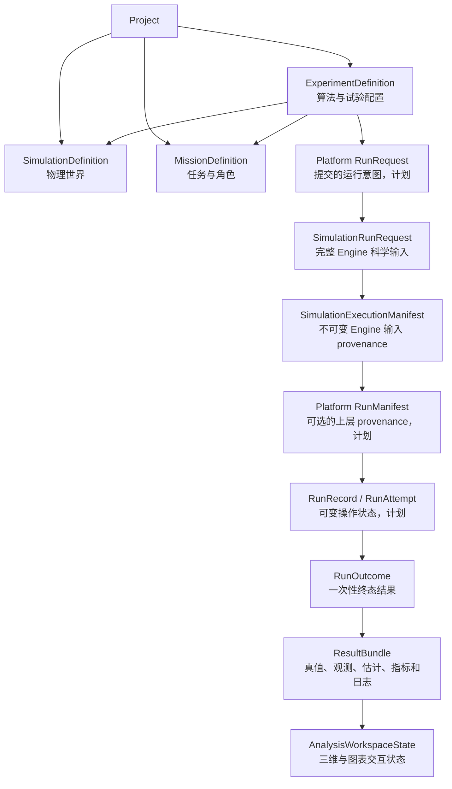
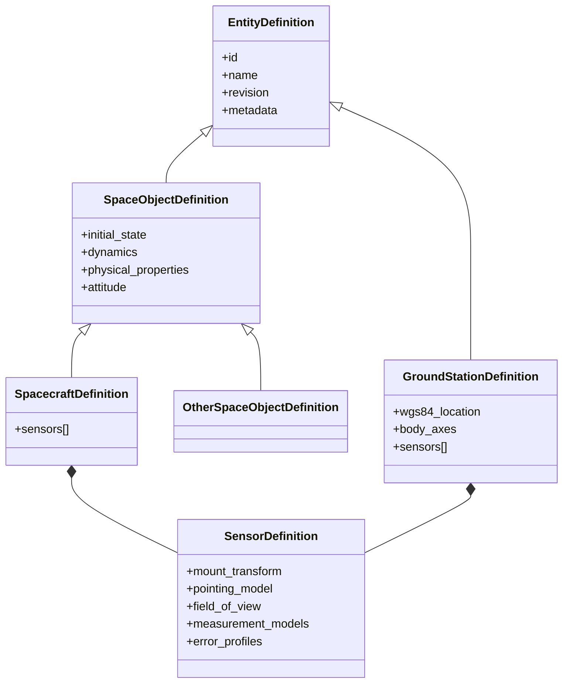
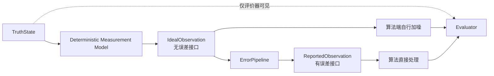
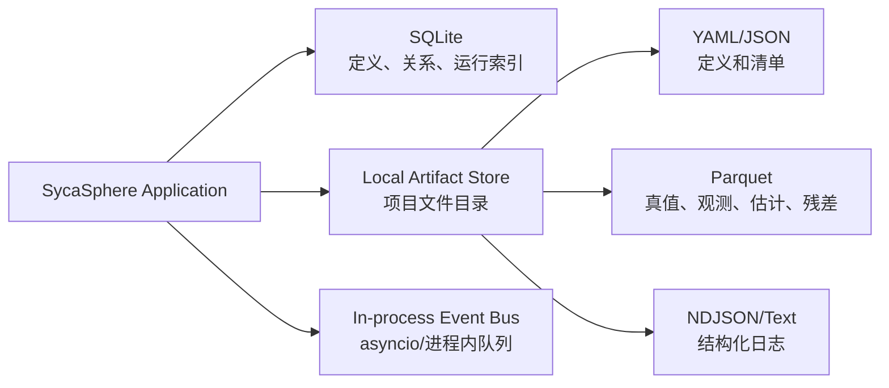

# SycaSphere 核心数据模型设计规范

**副标题：仿真世界、任务、实验、运行与分析交互型三维工作台**

| 项目 | 内容 |
| --- | --- |
| 项目名称 | SycaSphere |
| 文档版本 | v0.2 |
| 状态 | 开发基线 |
| 日期 | 2026-07-17 |
| 作者 | Sycamore |
| 适用范围 | SycaSphere 首个可开发版本 |

## 文档约定

本文使用以下规范性词语：

- **必须**：实现不可省略；不满足即视为违反当前设计基线。
- **应当**：原则上实现；如需偏离，必须在代码或设计记录中说明原因。
- **可以**：可选能力，不影响当前基线验收。

本文是 Codex 和人工开发者实现 SycaSphere 领域模型、存储边界、Orekit 适配层、观测生成以及三维工作台数据投影时的主要依据。若实现发现文档存在矛盾，不得自行选择其中一项并静默编码，应先修订设计文档或记录明确的架构决策。

---

## 1. 目标与当前边界

SycaSphere 当前定位为：

> **面向空间态势感知算法的交互式三维仿真与验证平台。**

当前版本面向 1 个至数十个空间对象，重点支持：

- 高保真轨道真值生成；
- 地基和天基传感器；
- 无误差观测与有误差观测双通道；
- 精密定轨、机动检测和联合估计算法验证；
- 外部算法接入；
- 真值、观测、估计、残差、协方差和机动结果的分析交互型三维展示；
- 可重复、可追溯的实验运行。

当前版本明确不实现：

- 万级空间目标目录；
- 分布式任务集群；
- Redis、Kafka 等外部消息基础设施；
- 完整多用户权限和安全域；
- 强化学习环境；
- AI 辅助设计师；
- 运行级业务目录、交会告警或作战指挥系统；
- 自研三维渲染引擎。

这些能力可以在核心模型稳定后扩展，但不得提前污染当前领域边界。

截至 2026-07-26，仓库实际实现的是 `sycasphere-core` 中的不可变领域契约，
包括仿真定义、机动、观测计划、运行请求和执行清单模型。Engine 的
`prepare()`/执行/会话、观测与结果生成、Orekit 适配，以及 Platform 的任务、
实验、运行生命周期和持久化仍是后续计划，不得把下文的目标架构理解为已交付运行时。

---

## 2. 总体分层

SycaSphere 必须把物理仿真、任务语义、实验配置和运行产物分开建模。



### 2.1 Project

`Project` 是用户工作空间的逻辑容器，用于组织仿真定义、任务定义、算法注册、实验和运行记录。它不承载轨道状态或任务执行语义。

### 2.2 SimulationDefinition

`SimulationDefinition` 只描述**物理世界是什么**：

- 环境和外部数据；
- 空间对象；
- 地面站；
- 传感器及安装关系；
- 初始状态和姿态；
- 动力学模型；
- 预设真实机动和其他基线真值事件。

它不得包含“目标”“主传感器”“被跟踪对象”等任务角色。Engine 接收的
`SimulationRunRequest` 必须嵌入完整 `SimulationDefinition`，不得使用数据库或修订
引用替代。一次执行的确切时间范围、输出采样、观测计划和命令时间线属于
`SimulationRunRequest`，不得回写到可复用的 `SimulationDefinition`。

首版要求所有空间对象的 `initial_state.epoch` 与
`SimulationDefinition.synchronization_epoch` 完全相等。未来可兼容升级为允许每个
对象的初始时刻不晚于同步时刻，再由 Engine 分别预推进到同步时刻；该升级保留现有
字段和已满足严格规则的 JSON，不改变首版数据含义。

### 2.3 MissionDefinition

`MissionDefinition` 只描述**在本次任务中要做什么**：

- 任务目标；
- 任务步骤；
- 对象和传感器的角色；
- 观测计划；
- 时间窗口；
- 资源分配；
- 成功条件和评价重点。

同一个 `SimulationDefinition` 可以被多个不同任务复用。

### 2.4 ExperimentDefinition

`ExperimentDefinition` 描述**如何验证算法**：

- 使用哪一个仿真修订版；
- 使用哪一个任务修订版；
- 接入哪些算法；
- 使用无误差还是有误差观测；
- 噪声由平台还是算法负责；
- 随机种子；
- 评价指标；
- 输出采样；
- 可视化配置。

### 2.5 运行对象与 ResultBundle

Core 已实现的 `SimulationRunRequest` 保存独立 Engine 的完整科学输入；计划中的
Engine `prepare()` 解析它并生成 `SimulationExecutionManifest`。该 Manifest 是只描述
解析后科学输入的不可变 provenance，记录精确配置、插件与数据版本、输入校验值和
预期输出，不是运行状态对象。

Platform 后续若保留自己的 `RunRequest`/`RunManifest` 概念，必须使用
`Platform RunManifest` 等清晰限定名称，并引用或嵌入
`SimulationExecutionManifest` 的哈希，再增加 Mission、Experiment、算法和评价输入
provenance；不得与 Engine Manifest 混用。可变运行状态和重试索引只由未来
`RunRecord` 和 `RunAttempt` 维护；开始/结束时间、最终状态、错误、运行时命令日志哈希
和输出哈希只由终态一次性生成的 `RunOutcome` 保存。`ResultBundle` 保存经过验证的
科学与诊断产物。完成的运行不得原地修改。

### 2.6 AnalysisWorkspaceState

`AnalysisWorkspaceState` 保存当前时间游标、相机、图层、对象选择、算法对比和面板布局。它可以修改，但不得修改已完成运行的科学结果。

---

## 3. Python 数值表示策略

### 3.1 不定义重量级 Vector3 和 StateVector6

SycaSphere 不建立带大量方法的 `Vector3`、`StateVector6` 领域类。

原因是：

- Python 和 NumPy 已经提供成熟的向量运算；
- 重复封装会增加转换和维护成本；
- 单独的六维向量不能表达时刻、坐标系和业务语义；
- API、JSON、Parquet 和跨语言接口最终仍需转换为基础数组。

### 3.2 三层表示

| 层 | 表示方式 | 约束 |
| --- | --- | --- |
| JSON/YAML/API 边界 | `list[float]` 或嵌套 `list` | 使用模式校验长度、数值类型和有限性。 |
| Python 领域对象 | 冻结边界模型中的定长元组 | 例如 `CartesianState.position_m`，不单独包装 Vector3；序列化时仍输出 JSON 数组。 |
| 数值计算内部 | `numpy.ndarray` | 三维向量 shape 为 `(3,)`，六维数组 shape 为 `(6,)`。 |

### 3.3 数组校验规则

三维数值列表必须：

- 长度严格为 3；
- 元素必须是严格、有限的浮点值，不接受字符串等隐式数值转换；
- 默认不得包含 `NaN` 或无穷大；
- 不得用 `[0, 0, 0]` 表示“缺失”；缺失使用 `null`；
- 进入数值核心时转换为 `numpy.float64`；
- 跨层传递时不得依赖可变列表的共享引用。

六维状态数组只作为计算或算法交换的派生视图：

```python
state_vector = np.concatenate([state.position_m, state.velocity_mps])
```

公开领域模型仍然使用 `CartesianState`，而不是匿名的六维列表。

### 3.4 领域边界模型

建议使用 Pydantic v2 实现 JSON/YAML/API 边界校验；数值核心不依赖 Pydantic 对象执行矩阵运算。

```python
class CartesianState(BaseModel):
    epoch: Epoch
    frame: FrameRef
    position_m: tuple[float, float, float]
    velocity_mps: tuple[float, float, float]
```

字段名直接包含 SI 单位，避免每个向量对象重复携带单位对象。

---

## 4. 时间、标识与版本

### 4.1 标识

每个核心对象必须有稳定的字符串 ID。建议使用 UUID，但 ID 的实现形式不得泄漏为业务语义。

- `id`：不可变主键；
- `name`：可修改显示名称；
- `revision`：定义对象的修订号；
- `schema_version`：数据模式版本；
- `tags`：用户检索标签，不作为逻辑判断依据。

### 4.2 时间

`Epoch` 必须显式声明时间尺度。

```yaml
epoch:
  value: "2026-07-17T00:00:00.000000Z"
  time_scale: UTC
```

当前至少支持：

- UTC；
- TAI；
- TT。

在线观测必须区分：

- `measurement_epoch`：物理观测时刻；
- `arrival_time`：算法获得该观测的时刻；
- `sequence_number`：消息源序号。

Python `datetime` 不能单独承担全部时间尺度语义。Orekit `AbsoluteDate` 只能存在于 Orekit 适配层，不得跨领域或算法接口传递。

### 4.3 单位

SycaSphere 内部和标准结果统一采用 SI：

| 量 | 单位 |
| --- | --- |
| 长度 | m |
| 速度 | m/s |
| 加速度 | m/s² |
| 角度 | rad |
| 角速度 | rad/s |
| 角加速度 | rad/s² |
| 质量 | kg |
| 时间间隔 | s |

用户界面可以显示 km、deg 等常用单位，但必须在显示层转换。

---

## 5. 坐标系规范

SycaSphere 对外公开的坐标系集合为：

- `J2000`；
- `EARTH_FIXED`；
- `LVLH`；
- `VVLH`；
- `BODY`；
- `SENSOR`。

不得在公共 API、配置或结果中使用模糊的 `ECI`、`ECEF` 字符串。

### 5.1 FrameRef

```yaml
frame:
  kind: LVLH
  owner_id: spacecraft-001
  convention: SYCASPHERE_LVLH_1
  reference_epoch:
    value: "2026-07-17T00:00:00Z"
    time_scale: UTC
```

不同坐标系需要不同的附加字段：

| kind | 必需附加字段 |
| --- | --- |
| J2000 | 无；Earth-centered 语义由公共名称隐含。 |
| EARTH_FIXED | `earth_fixed` 子对象内的 `itrf_realization`、`iers_conventions`、`eop_data_id`，以及 `representation: CARTESIAN` 或 `GEODETIC`；GEODETIC 还需 `ellipsoid: WGS84`。 |
| LVLH | `owner_id`、`convention`、`reference_epoch`。 |
| VVLH | `owner_id`、`convention`、`reference_epoch`。 |
| BODY | `owner_id`、`convention`、`reference_epoch`。 |
| SENSOR | `owner_id`（sensor_id）、`convention`、`reference_epoch`。 |

### 5.2 J2000

SycaSphere 的默认地心惯性坐标系名称统一为 `J2000`。

- 公共模型、UI、文件、API 和评价结果只使用 `J2000`；
- Orekit 适配器内部将 `J2000` 唯一映射为 Orekit `EME2000`；
- 该后端实现名称不得泄漏到公共模型；
- `J2000` 的 Earth-centered 语义由公共名称隐含，不重复保存 `center` 字段。

### 5.3 LVLH

SycaSphere 采用 STK 风格的右手 LVLH 约定：

\[
\hat{X}=\frac{\mathbf r}{\|\mathbf r\|}
\]

\[
\hat{Z}=\frac{\mathbf r\times\mathbf v}{\|\mathbf r\times\mathbf v\|}
\]

\[
\hat{Y}=\hat{Z}\times\hat{X}
\]

含义为：

- `+X`：径向向外；
- `+Y`：局部水平、沿轨方向；
- `+Z`：轨道法向。

LVLH 必须通过 `owner_id`、`convention` 和 `reference_epoch` 绑定参考对象、轴约定和构造时刻。定轨误差中的“径向、沿轨、法向”分别对应 LVLH 的 X、Y、Z 分量。

### 5.4 VVLH

SycaSphere 采用 STK 风格的惯性速度 VVLH：

- `+Z`：地心天底方向，即 `-r̂`；
- `+X`：速度在局部水平面内的投影方向；
- `+Y = +Z × +X`，完成右手系。

```text
Z = -normalize(r)
X = normalize(v - dot(v, Z) * Z)
Y = cross(Z, X)
```

VVLH 必须通过 `owner_id`、`convention` 和 `reference_epoch` 声明参考对象、包含速度参考语义的轴约定和构造时刻；首版不增加独立 `velocity_reference` 字段。

### 5.5 EARTH_FIXED 与 WGS84

`EARTH_FIXED` 是公共地固帧，必须显式声明 ITRF 实现、IERS 约定、EOP 数据版本和坐标表示。`WGS84` 只表示参考椭球，不是公共帧名：

```yaml
frame:
  kind: EARTH_FIXED
  earth_fixed:
    itrf_realization: ITRF2020
    iers_conventions: IERS_2010
    eop_data_id: iers-bulletin-a:2026-07-20
  representation: GEODETIC
  ellipsoid: WGS84
```

或：

```yaml
frame:
  kind: EARTH_FIXED
  earth_fixed:
    itrf_realization: ITRF2020
    iers_conventions: IERS_2010
    eop_data_id: iers-bulletin-a:2026-07-20
  representation: CARTESIAN
```

- `GEODETIC`：经度、纬度、椭球高；
- `CARTESIAN`：地心地固 X、Y、Z。

地面站的定义使用 `EARTH_FIXED`/`GEODETIC` 表示并声明 `ellipsoid: WGS84`。用于三维渲染时，后端生成 `EARTH_FIXED`/`CARTESIAN` 或 WGS84 经纬高数据。

### 5.6 BODY

`BODY` 坐标系依附于具体实体，由实体姿态定义。平台不假设所有航天器采用同一机体系轴向。

```yaml
frame:
  kind: BODY
  owner_id: spacecraft-001
  convention: attitude-law-001-rh
  reference_epoch:
    value: "2026-07-17T00:00:00Z"
    time_scale: UTC
```

地面站也具有本体系；模板可以提供 NED 等约定，但数据中必须显式记录具体轴定义。

### 5.7 SENSOR

`SENSOR` 坐标系依附于具体传感器，由安装变换和指向模型共同确定。

```text
J2000 → Platform BODY → Mount Transform → Gimbal/Pointing → SENSOR
```

传感器定义必须显式声明：

- 视轴方向；
- 横轴和纵轴；
- 安装位置偏移；
- 安装姿态；
- 转台或扫描模型；
- 像面约定（如适用）。

不得默认所有传感器都以 `+Z` 为视轴，除非所选模板明确这样规定。

### 5.8 坐标转换责任

- 科学计算坐标转换由后端完成；
- 三维前端不得自行实现简化的 `J2000`/`EARTH_FIXED` 帧转换或 WGS84 大地坐标转换；
- 所有转换必须保留源帧、目标帧、时刻和数据版本；
- 6×6 状态协方差在时变坐标系之间转换时，必须使用完整状态变换雅可比，不能只对位置和速度分别应用同一个 3×3 旋转矩阵。

---

## 6. 仿真实体与传感器层级

### 6.1 实体层级



### 6.2 EntityDefinition

实体只描述自身身份和物理能力，不描述本次任务角色。

| 字段 | 说明 |
| --- | --- |
| `id` | 稳定主键。 |
| `name` | 显示名称。 |
| `entity_type` | SPACECRAFT、OTHER_SPACE_OBJECT、GROUND_STATION。 |
| `metadata` | 非控制性的用户元数据。 |
| `capabilities` | 物理能力，例如可机动、可挂载传感器。 |
| `revision` | 实体定义修订版。 |

### 6.3 SpaceObjectDefinition

空间对象定义包含：

- 初始 `CartesianState` 或可转换的轨道元素；
- 传播模型引用；
- 质量、面积、阻力系数、光压系数等物理参数；
- 姿态模型；
- 可选机动能力；
- 可选传感器子组件。

空间碎片、箭体等不能搭载传感器的对象使用 `OtherSpaceObjectDefinition`。

### 6.4 GroundStationDefinition

地面站包含：

- `EARTH_FIXED`/`GEODETIC` 地理位置，并声明 WGS84 参考椭球；
- 站体坐标系定义；
- 可用时间；
- 可选环境属性；
- 传感器子组件。

### 6.5 SensorDefinition

传感器必须依附于 `SpacecraftDefinition` 或 `GroundStationDefinition`，不作为独立自由飞行实体。

序列化时建议嵌套保存：

```yaml
spacecraft:
  id: observer-spacecraft-001
  sensors:
    - id: optical-sensor-001
      sensor_type: OPTICAL
      mount_transform: mount-optical-001
```

数据库中可以使用 `parent_entity_id` 保存父子关系，但领域语义仍是组合关系。

传感器位置和姿态必须由父平台推导：

\[
\mathbf r_{sensor}^{J2000}=\mathbf r_{platform}^{J2000}
+\mathbf C_{BODY\rightarrow J2000}\,\mathbf r_{mount}^{BODY}
\]

传感器不得维护一套与父平台无关的轨道状态。

### 6.6 SensorDefinition 组成

| 组件 | 作用 |
| --- | --- |
| `mount_transform` | BODY 到传感器安装基准的固定位置和姿态。 |
| `pointing_model` | 固定、目标指向、扫描、转台或外部姿态序列。 |
| `field_of_view` | 圆锥、矩形、复杂掩膜等视场。 |
| `visibility_model` | 遮挡、地平、光照、太阳抑制角等。 |
| `measurement_models` | 可生成的理想观测类型。 |
| `error_profiles` | 可选的噪声、偏差、漏测和时延配置。 |
| `availability` | 工作时间、占用和故障窗口。 |

---

## 7. 任务模型与角色分配

### 7.1 为什么角色不放在实体上

“目标”“观测平台”“主传感器”等角色是任务上下文，不是实体固有属性。同一颗卫星在不同任务中可以承担不同角色。因此实体中禁止保存固定任务角色字段。

### 7.2 MissionDefinition

```yaml
mission:
  id: geo-maneuver-detection
  revision: 1
  objectives:
    - MANEUVER_DETECTION
    - PRECISE_ORBIT_DETERMINATION
  tasks:
    - id: collect-optical-observations
      task_type: OBSERVATION_COLLECTION
    - id: estimate-post-maneuver-orbit
      task_type: ORBIT_ESTIMATION
  role_assignments:
    - subject_ref: target-spacecraft-001
      role: sycasphere.mission/TRACKING_TARGET
    - subject_ref: optical-sensor-ground-001
      role: sycasphere.mission/PRIMARY_SENSOR
```

### 7.3 TaskDefinition

`TaskDefinition` 描述一个任务步骤：

- `task_type`；
- `time_window`；
- `target_refs`；
- `resource_refs`；
- `dependencies`；
- `parameters`；
- `success_criteria`。

### 7.4 RoleAssignment

```text
RoleAssignment
├── subject_ref
├── role
├── task_refs
├── valid_interval
└── parameters
```

角色可以指向：

- 空间对象；
- 地面站；
- 传感器；
- 算法绑定；
- 其他任务资源。

### 7.5 角色词汇表

当前不建设复杂的“角色管理系统”。

- 平台提供少量内置角色枚举；
- 自定义角色使用命名空间字符串；
- SQLite 可以单独保存 `role_assignments` 表；
- 以后确有需要时再增加 `RoleDefinition`，用于角色说明、颜色和约束。

实体的 `capabilities` 表示“能做什么”，任务角色表示“本次做什么”，两者不得混淆。

---

## 8. 真值状态与真实事件

### 8.1 CartesianState

```yaml
state:
  epoch:
    value: "2026-07-17T00:00:00Z"
    time_scale: UTC
  frame:
    kind: J2000
  position_m: [42164000.0, 1200.0, -800.0]
  velocity_mps: [-0.08, 3074.6, 0.12]
```

首版 `CartesianState` 只包含时刻、坐标系、位置和速度，不提供加速度兼容字段。加速度属于动力学输出或派生量；若未来需要进入公共边界，必须作为单独契约变更评审。

### 8.2 AttitudeState

姿态状态至少包含：

- 时刻；
- 参考坐标系；
- BODY 坐标系；
- 归一化四元数；
- 可选角速度和角加速度。

四元数的分量顺序和旋转方向必须在模式中固定，不得依赖库默认值。

### 8.3 TruthState

`TruthState` 是仿真引擎在某一时刻的真实状态快照，可以包含：

- `CartesianState`；
- `AttitudeState`；
- 质量；
- 动力学参数；
- 派生几何量；
- 真值事件状态。

它只对仿真内核、评价器和授权调试视图可见，不能作为正式被测算法输入。

### 8.4 TruthManeuver

真实机动和算法机动假设必须使用不同类型。

```yaml
truth_maneuver:
  id: maneuver-truth-001
  object_id: target-spacecraft-001
  maneuver_type: IMPULSIVE
  epoch:
    value: "2026-07-17T06:00:00Z"
    time_scale: UTC
  delta_v_mps: [0.0, 5.0, 0.0]
  frame:
    kind: LVLH
    owner_id: target-spacecraft-001
    convention: SYCASPHERE_LVLH_1
    reference_epoch:
      value: "2026-07-17T06:00:00Z"
      time_scale: UTC
```

---

## 9. 观测模型与双接口

### 9.1 数据流



### 9.2 ObservationEvent

`ObservationEvent` 表示一次真实发生或计划发生的观测事件，是理想观测和报告观测的共同来源。

| 字段 | 说明 |
| --- | --- |
| `event_id` | 双通道关联主键。 |
| `measurement_epoch` | 物理观测时刻。 |
| `sensor_id` | 传感器子组件 ID。 |
| `platform_id` | 父平台 ID。 |
| `target_ref` | 目标或匿名 tracklet 引用。 |
| `measurement_type` | 观测类型。 |
| `geometry_status` | 可见、遮挡、超出视场、光照不足等。 |
| `model_profile_id` | 确定性测量模型。 |

### 9.3 IdealObservation：无误差接口

`IdealObservation` 是通过可见性、指向和确定性测量模型得到的观测值，但未加入随机和系统误差。

无误差并不意味着忽略：

- 传感器位置和姿态；
- 视场；
- 地球或天体遮挡；
- 光照条件；
- 光行时；
- 站址运动；
- 由配置启用的确定性修正。

系统必须提供显式接口：

```text
generate_ideal_observation(event, truth_context) -> IdealObservation
```

### 9.4 ReportedObservation：有误差接口

`ReportedObservation` 由理想观测经过 `ErrorPipeline` 生成。

```text
apply_error_pipeline(ideal, error_profile, seed) -> ReportedObservation | None
```

误差管线可以包含：

1. 随机噪声；
2. 系统偏差；
3. 时钟偏差和抖动；
4. 量化；
5. 离群值；
6. 漏测；
7. 到达延迟。

返回 `None` 表示误差模型没有形成可报告观测；引擎必须另行生成内部 `ObservationDeliveryRecord`，记录 `SENSOR_MISSED` 或 `QUALITY_REJECTED` 等结构化事实。该记录不是观测，不发送给算法。

### 9.5 双通道规则

- Ideal 和 Reported 必须共享 `event_id`；
- 系统可以同时存储两者，但一次正式算法运行只开放所选通道；
- 算法端加噪时输入为 Ideal；
- 平台端加噪时输入为 Reported；
- 正式算法评测不得同时读取 Ideal、Reported 和 Truth；
- 漏测、质量拒绝和链路丢包由 `ObservationDeliveryRecord` 与聚合的 `DeliverySummary` 记录，但不得向算法发送伪造的零值观测或丢失观测内容；首版不提供 `NonDetectionReport`。

### 9.6 地基与天基观测

地基和天基传感器共用同一 `ObservationEvent` 和 Observation 类型。差异来自父平台状态、姿态、可见性和误差配置，不应建立两套不兼容接口。

天基观测必须考虑：

- 观测航天器轨道和姿态；
- 传感器安装偏置；
- 地球、月球等遮挡；
- 太阳抑制角和光照；
- 目标和观察者的相对运动；
- 移动平台时钟和姿态误差。

### 9.7 标准观测类型

| 类型 | 数值维度 | 默认表达坐标系 | 说明 |
| --- | ---: | --- | --- |
| `ANGLES_RA_DEC` | 2 | J2000 | 赤经、赤纬，单位 rad。 |
| `ANGLES_AZ_EL` | 2 | SENSOR 或站体局部系 | 方位、仰角，必须声明轴约定。 |
| `RANGE` | 1 | 标量 | 单程或双程必须在元数据中说明。 |
| `RANGE_RATE` | 1 | 标量 | 必须说明符号和积分时间。 |
| `LOS_UNIT_VECTOR` | 3 | J2000 或 SENSOR | 视线单位矢量。 |
| `CUSTOM` | 可变 | 显式 | 使用命名空间和独立模式。 |

### 9.8 LOS 派生几何量

仿真内部可以保存：

- 距离；
- 距离率；
- LOS 单位矢量；
- LOS 角速度；
- LOS 角加速度。

这些量默认属于 `DerivedGeometry` 或真值诊断，不自动作为真实传感器观测提供给算法。只有测量模型明确声明时，才转换为 Observation。

---

## 10. 估计、协方差、机动和误差

### 10.1 TrackEstimate

```text
TrackEstimate
├── track_id
├── epoch
├── state
├── covariance
├── validity_interval
├── source_observation_refs
├── algorithm_ref
└── quality
```

轨迹 ID 不等于真值目标 ID。是否公开关联关系由任务和实验策略决定。

### 10.2 CovarianceMatrix

协方差必须声明：

- 矩阵数值；
- 状态分量顺序；
- 时刻；
- 坐标系；
- 参考状态；
- 每个分量的单位；
- 是否为估计协方差、预测协方差或经验协方差。

协方差必须通过对称性和数值有效性检查。严重非正定不得静默修复。

### 10.3 ManeuverHypothesis

算法输出的机动使用 `ManeuverHypothesis`：

- 估计时刻或时间窗；
- 瞬时或有限时长；
- 可选 Δv；
- Δv 坐标系；
- 置信度；
- 检测统计量；
- 证据引用；
- 算法版本。

### 10.4 残差和误差符号

平台统一规定：

- 测量残差：`observed - predicted`；
- 状态误差：`estimate - truth`。

外部算法使用其他符号时，适配器必须转换并记录来源定义。

### 10.5 定轨误差坐标系

当前必须支持：

- `J2000`：X、Y、Z 位置和速度误差；
- `LVLH`：径向、沿轨、法向误差。

可以支持：

- VVLH；
- `EARTH_FIXED`/`CARTESIAN`；
- BODY；
- SENSOR。

局部坐标误差必须绑定参考对象、参考轨迹和构造时刻。默认以 TruthState 构造 LVLH；其他基准必须在评价配置中显式选择。

---

## 11. 实验、运行和可追溯性

### 11.1 ExperimentDefinition

```yaml
experiment:
  id: geo-optical-maneuver-validation
  simulation_revision: geo-truth-world@2
  mission_revision: geo-maneuver-mission@1
  observation_policy:
    channel: REPORTED
    noise_responsibility: PLATFORM
  algorithm_bindings:
    - algorithm_id: sycasphere.baseline/batch-od
    - algorithm_id: user.example/maneuver-detector
  random_seed: 20260717
  evaluation_profile: geo-od-md-default
  visualization_profile: interactive-ssa-default
```

### 11.2 SimulationRunRequest 与 SimulationExecutionManifest

Core 已实现的 `SimulationRunRequest` 是完整、后端中立的 Engine 科学输入：

- 嵌入完整 `SimulationDefinition`；
- `time_range` 是闭区间；
- `output_sampling` 的采样周期独立于科学后端的数值积分步长和容差；
- 首版 `command_timeline` 只包含 `ManeuverCommand`；
- 首版 `observation_schedules` 只包含 `PERIODIC` 和 `EXPLICIT`；
- 测量模型和误差模型从 `SensorDefinition` 选择，不在请求顶层重复保存引用；
- 数据链路仍通过运行级 `link_models` 配置；
- 主随机种子和输出要求随请求冻结。

同一时刻的权威事件顺序为：传播到时刻、保存机动前状态、执行机动、保存机动后事实与
状态、使用机动后状态尝试观测、最后生成该时刻的常规采样。因此同刻观测是
post-maneuver observation，不提供可切换的机动前观测解释。

计划中的 Engine `prepare()` 成功后生成不可变
`SimulationExecutionManifest`，记录：

- 完整源请求及其哈希；
- `SimulationDefinition` 哈希；
- 解析后的精确插件实现与配置哈希；
- EOP、闰秒、重力场、星历等实际外部数据版本和哈希；
- 稳定派生的随机流；
- 紧凑的机动、观测和采样时间线；
- 版本化同刻事件顺序和预期输出；
- Manifest 内容哈希。

`SimulationExecutionManifest` 自生成起不可变，不包含准备、开始或结束墙上时间、
运行状态、错误、输出产物哈希、本地路径或运行时追加命令。相同请求、插件版本和
外部数据必须产生等价 Manifest。

Platform 后续若保留 `RunManifest`，它是独立的上层 provenance：引用
`SimulationExecutionManifest` 哈希并增加 Mission、Experiment、算法和评价输入。
Platform Manifest 同样不得承载可变状态或终态输出。

### 11.3 RunRecord 与 RunAttempt

`RunRecord` 保存可变的操作状态和保留策略；状态按照 `CREATED → VALIDATING → QUEUED → RUNNING → FINALIZING → 终态` 推进。`RunAttempt` 表示一次实际执行尝试。可重试故障必须创建新的 Attempt，并继续引用同一个 `SimulationExecutionManifest` 及可选 Platform Manifest；修改科学输入必须创建新的 Run。

### 11.4 RunOutcome 与 ResultBundle

`RunOutcome` 在运行进入终态时一次性生成，必须记录：

- `SimulationExecutionManifest` 哈希及可选 Platform Manifest 哈希；
- 最终状态；
- 开始和结束时间；
- 实际运行环境摘要；
- 输出产物哈希；
- 最终运行时命令日志哈希；
- `ResultBundle` 引用；
- 可选结构化错误。

失败和取消也必须产生 Outcome。只有经过模式与数值校验的部分产物才能以 `PARTIAL` 发布；未验证的临时文件不是科学结果。

### 11.5 不可变运行

- 已提交的 ExperimentDefinition 不得被运行过程修改；
- `SimulationExecutionManifest`、可选 Platform Manifest、RunOutcome、
  ResultBundle 和已经发布的科学产物不得原地覆盖；
- RunRecord 的状态、保留级别和 Attempt 索引可以按照状态机更新，但不得回写科学输入；
- 用户在三维工作台中修改机动、任务或算法参数时，创建新的实验修订或运行分支；
- 分析注释和视图状态可以单独修改。

---

## 12. 本地优先存储架构

### 12.1 当前方案



当前使用：

- **SQLite**：项目元数据、版本关系、算法注册、任务、实验和运行索引；
- **YAML/JSON**：可审阅的定义、清单和小型结果；
- **Parquet**：真值、观测、估计、残差、协方差和指标等时间序列；
- **本地文件目录**：报告、模型、日志、外部数据和其他 artifact；
- **进程内事件总线**：运行进度和前端推送。

当前不使用 Redis。

### 12.2 为什么当前不使用 Redis

当前范围是本地单机、少量并发和 1 至数十个对象。Redis 会引入额外服务、端口、部署和一致性成本，而目前没有必须由分布式缓存或消息代理解决的问题。

### 12.3 端口抽象

上层代码必须依赖接口，而不是直接依赖 SQLite 或本地路径：

```text
MetadataRepository
ArtifactStore
RuntimeEventBus
```

当前实现分别是 SQLite、本地文件系统和进程内事件总线。以后进入多用户或多实例部署时，可以替换为 PostgreSQL、对象存储和 Redis/其他消息系统，而不改变领域模型。

### 12.4 推荐项目数据目录

```text
project-data/
├── sycasphere.db
├── definitions/
│   ├── simulations/
│   ├── missions/
│   └── experiments/
├── assets/
│   ├── models/
│   └── external-data/
└── runs/
    └── <run-id>/
        ├── manifest.json
        ├── outcome.json
        ├── truth.parquet
        ├── ideal-observations.parquet
        ├── reported-observations.parquet
        ├── estimates.parquet
        ├── maneuvers.parquet
        ├── residuals.parquet
        ├── metrics.parquet
        └── logs.ndjson
```

---

## 13. 分析交互型三维工作台

### 13.1 技术基线

三维前端采用：

- React；
- TypeScript；
- CesiumJS；
- Apache ECharts；
- REST 用于定义、历史结果和查询；
- WebSocket 用于运行状态和时间动态更新。

### 13.2 交互能力

首个三维工作台必须支持：

- 开始、暂停、继续、停止；
- 单步推进；
- 时间跳转；
- 加速和减速；
- 仿真速度与数值积分精度分离；
- 点击空间对象和传感器；
- 相机跟随、锁定和自由浏览；
- 显示真值、估计和预测轨道；
- 显示地面站和天基观察者；
- 显示传感器视场和 LOS；
- 显示观测窗口和观测事件；
- 显示协方差椭球及放大比例；
- 显示真实机动和算法检测机动；
- 多算法图层开关和对比；
- 三维时间游标与残差、误差、协方差和检测统计图同步。

### 13.3 科学数据与渲染数据分离

```text
J2000 科学结果
      ↓ 后端高精度转换
EARTH_FIXED/CARTESIAN 渲染采样
      ↓ REST / WebSocket / CZML 导出
CesiumJS
```

CesiumJS 数据不是科学主存储。前端不得反向修改已完成运行中的 TruthState 或 TrackEstimate。

### 13.4 工作台状态

`AnalysisWorkspaceState` 可以保存：

- 当前时间；
- 播放速度；
- 相机状态；
- 当前选中对象；
- 可见图层；
- 算法颜色映射；
- 图表布局；
- 标注和分析书签。

用户通过交互修改科学输入时，必须产生新的 `SimulationRevision`、`MissionRevision` 或 `ExperimentRevision`。

---

## 14. 核心对象清单

### 领域定义

- `ProjectDefinition`
- `SimulationDefinition`
- `EnvironmentDefinition`
- `EntityDefinition`
- `SpaceObjectDefinition`
- `SpacecraftDefinition`
- `GroundStationDefinition`
- `SensorDefinition`
- `MissionDefinition`
- `TaskDefinition`
- `RoleAssignment`
- `ExperimentDefinition`

### 状态与事件

- `Epoch`
- `FrameRef`
- `CartesianState`
- `AttitudeState`
- `TruthState`
- `TruthManeuver`
- `ObservationEvent`
- `IdealObservation`
- `ReportedObservation`
- `ObservationDeliveryRecord`
- `DeliverySummary`
- `StreamingObservationEnvelope`

### 算法与评价结果

- `TrackEstimate`
- `CovarianceMatrix`
- `ManeuverHypothesis`
- `MeasurementResidualSeries`
- `StateErrorSeries`
- `MetricResult`

### 运行与展示

- `SimulationRunRequest`（Core 已实现的完整 Engine 输入）
- `SimulationExecutionManifest`（Core 已实现的不可变 Engine 输入 provenance）
- Platform `RunRequest` / `RunManifest`（计划中的上层审计与 provenance）
- `RunRecord`（计划中的可变状态）
- `RunAttempt`（计划中的执行尝试）
- `RunOutcome`（计划中的一次性终态）
- `ResultBundle`（计划）
- `ArtifactRef`（计划）
- `AnalysisWorkspaceState`（计划）

---

## 15. 开发阶段

### 当前已实现：Core 契约

- Pydantic v2 冻结边界模型、严格类型和深度不可变输入；
- `Epoch`、公共帧、`CartesianState`、实体、传感器和父子关系；
- `SimulationDefinition`、机动、闭区间时间范围、输出采样以及
  `PERIODIC`/`EXPLICIT` 观测计划；
- 完整 `SimulationRunRequest` 和不可变 `SimulationExecutionManifest` 数据契约；
- 公开 API、JSON Schema 快照、单元测试和独立 Core 分发。

### 计划：Engine 与 Orekit 真值/观测

- Engine `prepare()`、执行、交互会话和恢复；
- JVM 生命周期和 J2000 后端映射；
- 空间对象传播以及地面站和天基平台状态；
- Ideal/Reported 观测、误差与链路管线；
- Truth、观测和诊断结果写入。

### 计划：任务、实验、Platform 运行生命周期与持久化

- `MissionDefinition`、`TaskDefinition` 和 `RoleAssignment`；
- `ExperimentDefinition`；
- Platform `RunRequest`/`RunManifest`、`RunRecord`、`RunAttempt`、
  `RunOutcome` 和 `ResultBundle`；
- SQLite repository、本地 artifact store 和 Parquet 表模式；
- 运行状态机、保留策略和可重复运行编排。

### 计划：分析交互型三维工作台

- CesiumJS 场景、时间控制、对象树和选择；
- 轨迹、传感器、LOS、协方差和机动图层；
- ECharts 同步分析和多算法结果对比。

---

## 16. 数据不变量与验收条件

### 16.1 数据不变量

1. 所有状态必须包含时刻和坐标系。
2. J2000 是唯一公共惯性坐标系名称。
3. LVLH、VVLH、BODY 和 SENSOR 必须绑定 owner。
4. Sensor 必须属于 Spacecraft 或 GroundStation。
5. 实体不得保存任务角色。
6. MissionDefinition 不得修改物理真值。
7. Ideal 和 Reported 必须共享 observation event ID。
8. TruthState 和 TruthManeuver 不得进入正式算法输入。
9. 状态误差为 estimate - truth；残差为 observed - predicted。
10. 完成运行的输入和结果不可原地修改。
11. Redis 不属于当前运行依赖。
12. 前端不得承担权威坐标转换。

### 16.2 验收条件

- 同一个物理仿真可绑定两个不同任务，不修改实体定义。
- 同一个空间对象在不同任务中可被赋予不同角色。
- 地面站和卫星均可嵌套传感器，并正确推导传感器状态。
- 理想观测和报告观测可分别生成、关联和选择性提供给算法。
- 定轨误差能够在 J2000 和 LVLH 中输出。
- 后续运行时可通过 `SimulationExecutionManifest` 与最终
  `RuntimeCommandJournal` 重建其关键科学配置和运行时命令，并通过
  `RunOutcome` 校验终态和输出哈希。
- 真值、估计、传感器、LOS、协方差和机动可在 CesiumJS 工作台中交互查看。
- 存储层在不引入 Redis 的情况下支持当前单机运行。

---

## 17. 延后设计

以下能力只保留扩展方向，不进入当前实现：

- 强化学习动作和环境协议；
- 多智能体对抗；
- AI 辅助设计师；
- 分布式任务调度；
- Redis 或其他外部消息系统；
- PostgreSQL 和对象存储；
- 多用户安全、权限、审计和安全域；
- 万级空间目标和 GPU 批量传播；
- 完整目标目录、数据关联和交会业务服务。

---

## 18. 参考资料

1. Orekit FramesFactory：J2000/EME2000 后端对应关系。<https://www.orekit.org/static/apidocs/org/orekit/frames/FramesFactory.html>
2. Ansys STK Components：LVLH 轴定义。<https://help.agi.com/STKComponentsJava/Javadoc/agi-foundation-geometry-AxesLocalVerticalLocalHorizontal.html>
3. Ansys STK Components：VVLH 轴定义。<https://help.agi.com/STKComponentsJava/Javadoc/agi-foundation-geometry-AxesVehicleVelocityLocalHorizontal.html>
4. Ansys STK Object Model Tutorial：Sensor 作为 Satellite 等对象的子对象。<https://help.agi.com/stk/13.0.0/LinkedDocuments/STKTutorial.pdf>
5. CesiumJS Fundamentals。<https://cesium.com/learn/cesiumjs-fundamentals/>
6. CesiumJS Entity API。<https://cesium.com/learn/cesiumjs-learn/cesiumjs-creating-entities/>
7. SQLite 官方说明。<https://www.sqlite.org/about.html>
8. Apache Arrow / Parquet Python 文档。<https://arrow.apache.org/docs/python/parquet.html>
9. Orekit Orbit Determination Architecture。<https://www.orekit.org/site-orekit-latest/architecture/estimation.html>
